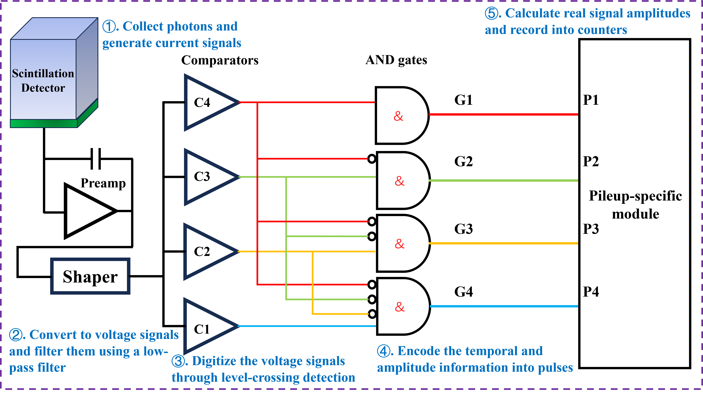
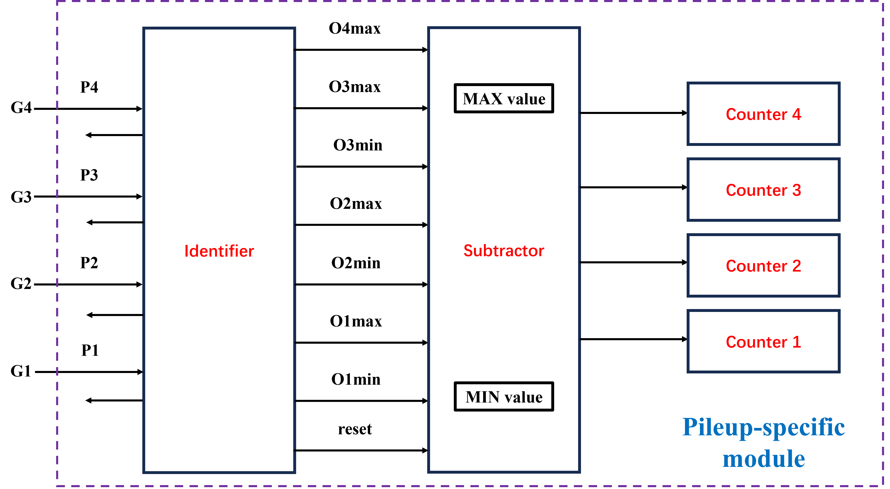

# AsyncPS_for_PCCT
## Digital asynchronous event-based circuits for photon detection in modern CT scans

This repository contains all key source codes developed during Jinhui Liu's master thesis project. This study explores the integration of asynchronous event-driven circuitry with photon-counting technology to enhance detection performance in modern computed tomography (CT) systems. Asynchronous circuits are wellsuited for event-driven applications, including photon-counting imaging. However, conventional architectures, such as the threshold subtraction (TS) and direct binning (DB) schemes, have not been implemented at the circuit level, and their performance is limited by challenges, such as pulse pile-up and charge crosstalk. To address these limitations, we propose a novel pileup-specific (PS) system that mitigates pile-up effects by extracting both the onset and peak information of pulse events.

Each part of the work contains its own README file with its set of instructions, file structure and source codes. This repository consists of two main parts:

 
